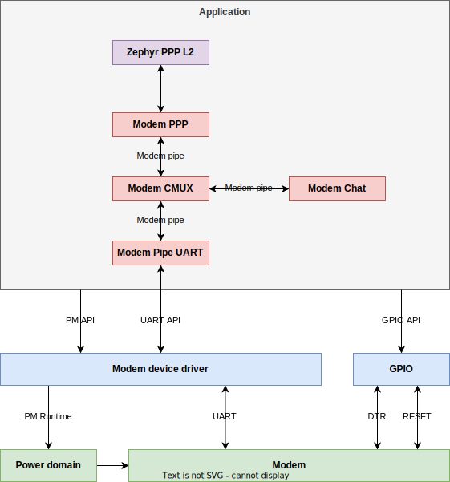

# Modem subsystem for Zephyr RTOS
## Introduction
The modem subsystem adds Zephyr implementations of the popular Linux programs: chat and pppd, and a CMUX module. All modules except the modem_ppp (pppd)b which is statically tied to a PPP L2 network interface, can be dynamically interconnected during runtime. This allows for dynamically adjusting to specific modems during runtime.

## What issue will the modem subsystem solve?
Modems on Zephyr RTOS currently offer limited capabilties and features compared to the capabilties and features offered by the modems. The main limiting factor lies with how the Zephyr Device Driver model is being used to create generic drivers for the modems. This forces many subsystems like command handling, CMUX, PPP networking, GPIO interactions etc. to be implemented in every driver, although these subsystems are inherently generic.

## How will the modem subsystem solve the issue?
The modem subsystem relies only on the serial interface to the modem, power management of the modem, and the GPIO control, from the Device Driver model. All functionality like command handling, PPP, CMUX, checking DTR, etc. is implemented at the application / subsystem level. This provides full access to all features offered by the modems from the application, be it cellular, GNSS, WIFI or other.



## Isn't this already implemented in Zephyr?
Zephyr currently has a working device driver, gsm_ppp, which uses CMUX, PPP and a command handler. However, it is not built in a modular fasion. The objects used by the driver are tightly coupled together using public headers and Kconfigs, which makes them hard to test and reuse. The objects depend highly on Kconfigs to allocate lists of fixed lenghts for objects and buffers to be allocated during runtime, which makes the configuration and use of said modules difficult. The objects referenced are:
* PPP L2 network device and PPP frame wrapper (drivers/net/ppp.c)
* gsm mux which sets up CMUX (drivers/console/gsm_mux.c)
* uart mux which creates a list of virtual devices using UART API (drivers/console/uart_mux.c)

Potentially for these reasons, of these objects, only the ppp.c is currently tested. After reviewing the gsm_ppp driver and dependencies, it became clear creating a novel modular subsystem for the modems using the newest features of Zephyr, which additionally mimics the daemons available on Linux, was a better approach than changing the existing implementation.

This decision allows the gsm_ppp driver and its dependencies and the novel subsystem to persist in parralel, making it a choise for the user of Zephyr which approach to use.

## Modular design?
The modem modules in the modem subsystem are loosely coupled using the modem_pipe structure and API. This is a simple bytes in/bytes out pipe with a callback when data is ready. Decoupling the modules using this interface makes testing the modules independently staight forward, using mocks which implement the modem_pipe API. It also allows for easily switching "backends", like (modem_pipe -> UART API) could be switched for (modem_pipe -> IPC) and using a CMUX DLCI channel could be switched for using the modem UART directly.

## Portability
Using the modem subsystem, the Device Driver layer is only tasked with power management and providing a serial interface to the modem. Everything above the serial interface is handled by the application, using the modem subsystem. This interface could be IPC, UART, I2C, etc. Simply create a backend for the specific phy and the modem subsystem will be able to use it.

## How to run the sample
1. Set up a clean Zephyr workspace
2. Clone this repo to the workspace
3. Run the following command in your terminal **export ZEPHYR_EXTRA_MODULES="$PWD/modem_modules"**
4. Add .overlay file to this folder modem_modules/samples/subsys/modem/cmux_ppp for your board
5. Create alias in the .overlay file for the UART used for your modem
6. Add any board specific dependencies to the modem_modules/samples/subsys/modem/cmux_ppp/prj.conf file
7. Build the sample using the command **west build -p -b \<your board> modem_modules/samples/subsys/modem/cmux_ppp**
8. Run the application, you should get the console output
```
*** Booting Zephyr OS build zephyr-v3.2.0-4297-g18ce85c20130 ***
CMUX connected
DLCI channels opened
Modem registered to network
Network L4 connected
Network L4 disconnected
CMUX disconnected
Sample complete
```
